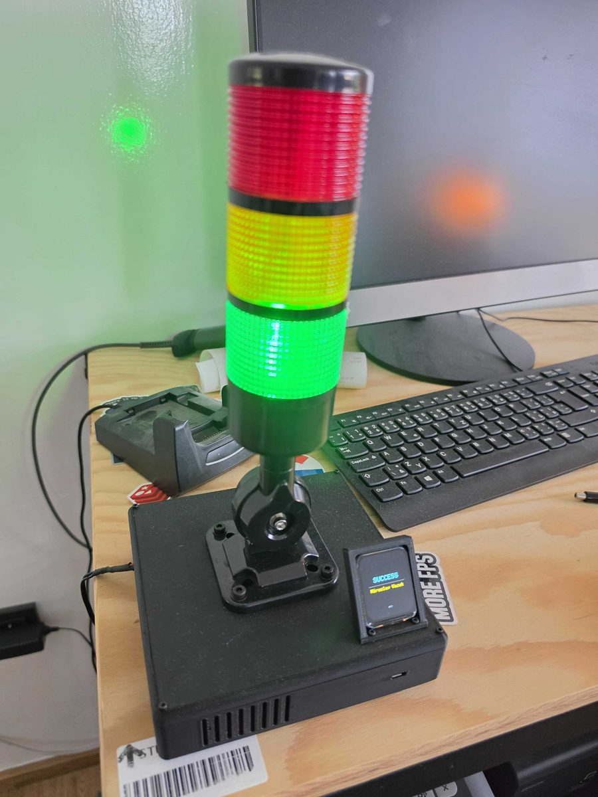

# gitlab-pipeline-semaphor

Firmware for a GitLab pipeline status indicator, running on an ESP8266 (NodeMCU v2). A relay-driven traffic light and a TFT display show the status of the latest pipeline, and the firmware updates itself from GitHub Releases.



## Hardware

- ESP8266 NodeMCU v2
- 3x relay (red, yellow, green), active HIGH
- Traffic light tower (signal tower) switched by the relays
- TFT display (ST7789, 240x280) over SPI
- Backlight controlled by a GPIO pin

Wiring (can be changed in [include/config.h](include/config.h) and [platformio.ini](platformio.ini)):

| Signal | GPIO | NodeMCU pin |
|---|---|---|
| Red relay | 15 | D8 |
| Yellow relay | 0 | D3 |
| Green relay | 16 | D0 |
| Display backlight | 2 | D4 |
| Display MOSI (DIN) | 13 | D7 |
| Display SCLK (CLK) | 14 | D5 |
| Display CS | 12 | D6 |
| Display DC | 4 | D2 |
| Display RST | 5 | D1 |

GPIO 0, 2 and 15 are ESP8266 boot strapping pins. If the board does not boot or flash with the relays connected, check that the relay modules do not pull these pins away from their boot levels (GPIO 0 and 2 high, GPIO 15 low).

## Behavior

Every 10 s the device fetches the latest pipeline from `API_URL` and shows its status:

| Pipeline status | Light | Display |
|---|---|---|
| running, pending, scheduled, manual | yellow | "WAITING" + author |
| success | green | "SUCCESS" + author |
| failed | red | "FAILED" + author |
| created, waiting_for_resource, preparing, canceled, skipped | unchanged | unchanged |

On a request or parsing error all three lights turn off. A non-200 HTTP response (for example 401 with a wrong token) is only logged to the serial monitor and the light stays as it was.

The display shows the status in the middle, the name of the user who triggered the pipeline below it and "WPJ" at the bottom. It is redrawn only when the status or the author changes.

## Configuration

Everything is in [include/config.h](include/config.h): the GitLab API URL, poll interval, request timeout and relay/backlight pins. Display pins and SPI settings are build flags in [platformio.ini](platformio.ini).

`API_URL` points to the `pipelines/latest` endpoint of one project:

```
https://<gitlab-host>/api/v4/projects/<project-id>/pipelines/latest
```

The project ID is shown on the project's main page in GitLab. The endpoint returns the latest pipeline of the default branch.

HTTPS certificates are not verified (`setInsecure()`), both for the GitLab API and for OTA downloads.

## Font

The display uses the smooth font `Charis_SILR.vlw` (Charis SIL, includes Czech diacritics) from [data/](data/). It must be in SPIFFS, otherwise the firmware stops at startup and prints `Font missing in SPIFFS` to the serial monitor. Upload it once over USB:

```
pio run -t uploadfs
```

OTA updates only replace the firmware, not the filesystem, so this step is not repeated by GitHub Actions.

## WiFi and GitLab token

Copy [include/secrets.example.h](include/secrets.example.h) to `include/secrets.h` (it is in `.gitignore`) and fill it in:

```cpp
#define SECRET_SSID "wifi-name"
#define SECRET_PASS "wifi-password"

#define SECRET_GITLAB_TOKEN "gitlab-personal-access-token"
```

The GitLab token needs the `read_api` scope and access to the project in `API_URL`. A project access token with the Reporter role works as well.

On the first upload over USB the WiFi credentials and the GitLab token are saved to EEPROM. Firmware built by GitHub Actions has no `secrets.h` and uses the saved values. To change them, edit `secrets.h` and upload the firmware over USB again.

## Build and upload

Requires [PlatformIO](https://platformio.org/) (CLI or the VS Code extension).

```
pio run -t upload
pio device monitor
```

On startup the yellow light turns on and the display shows "WELCOME" while the device connects to WiFi and checks for updates. Normal polling then takes over. The firmware also prints its version and the result of the update check to the serial monitor.

## Source layout

- `src/main.cpp` – `setup()`, `loop()` and moving the token saved by older firmware to the new EEPROM layout
- `src/Pipeline.cpp` – fetches and parses the pipeline status, drives the light and display
- `src/Semaphore.cpp` – relay control
- `src/Display.cpp` – TFT output and the SPIFFS font
- `include/config.h` – API URL, timing and pins
- `include/WifiCredentials.h` – uses `secrets.h` if it exists
- `data/` – font uploaded to SPIFFS
- `lib/User_Setup.h` – TFT_eSPI setup kept for reference; the build uses the flags in `platformio.ini` instead (`USER_SETUP_LOADED`)

## Firmware update (OTA)

Uses the [esp-ota-updater](https://github.com/davidvancl/esp-ota-updater) library. On startup the device checks the latest release and updates itself if a newer version exists.

Releasing a new version:
1. Increase `custom_version` in `platformio.ini`.
2. Commit and push to `main`.
3. GitHub Actions publish a release. The device updates after its next restart.

Do not push a locally changed version in `platformio.ini` unless you want to publish a release.

## License

[MIT](LICENSE)
